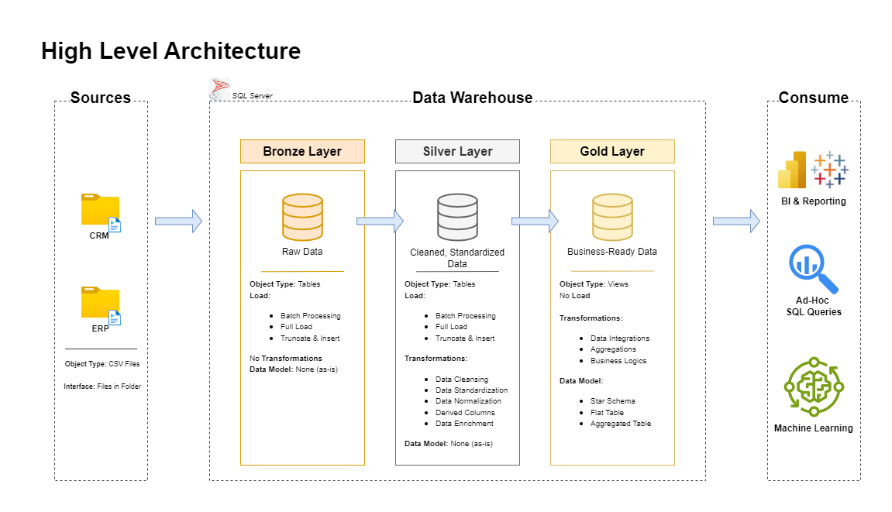

# Data Warehouse and Analytics Project

Welcome to the **Data Warehouse and Analytics Project** repository! 🚀  
This project demonstrates a comprehensive data warehousing and analytics solution, from building a data warehouse to generating actionable insights. Designed as a portfolio project, it highlights industry best practices in data engineering and analytics.

---

## 📖 Project Overview

This project involves:

1. **Data Architecture**: Designing a Modern Data Warehouse Using Medallion Architecture **Bronze**, **Silver**, and **Gold** layers.
2. **ETL Pipelines**: Extracting, transforming, and loading data from source systems into the warehouse.
3. **Data Modeling**: Developing fact and dimension tables optimized for analytical queries.
4. **Analytics & Reporting**: Creating SQL-based reports and dashboards for actionable insights.

🎯 This repository is an excellent resource for professionals and students looking to showcase expertise in:
- SQL Development
- Data Architect
- Data Engineering  
- ETL Pipeline Developer  
- Data Modeling  
- Data Analytics  

---

## 🏗️ Data Architecture

The data architecture for this project follows Medallion Architecture **Bronze**, **Silver**, and **Gold** layers:


1. **Bronze Layer**: Stores raw data as-is from the source systems. Data is ingested from CSV Files into SQL Server Database.
2. **Silver Layer**: This layer includes data cleansing, standardization, and normalization processes to prepare data for analysis.
3. **Gold Layer**: Houses business-ready data modeled into a star schema required for reporting and analytics.

---

## 🚀 Project Requirements

### Building the Data Warehouse (Data Engineering)

#### Objective
Develop a modern data warehouse using SQL Server to consolidate sales data, enabling analytical reporting and informed decision-making.

#### Specifications
- **Data Sources**: Import data from two source systems (ERP and CRM) provided as CSV files.
- **Data Quality**: Cleanse and resolve data quality issues prior to analysis.
- **Integration**: Combine both sources into a single, user-friendly data model designed for analytical queries.
- **Scope**: Focus on the latest dataset only; historization of data is not required.
- **Documentation**: Provide clear documentation of the data model to support both business stakeholders and analytics teams.

---

### BI: Analytics & Reporting (Data Analysis)

#### Objective
Develop SQL-based analytics to deliver detailed insights into:
- **Customer Behavior**
- **Product Performance**
- **Sales Trends**

These insights empower stakeholders with key business metrics, enabling strategic decision-making.  

---

## 📂 Repository Structure
```
data-warehouse-analysis-project/
│
├── data_analysis_advanced/             # Advanced data analysis. Answers business questions.
│   ├──  01_change_over_time_analysis   # Analyze how a measure evolves over time.
│   ├──  02_cumulative_analysis         # Aggregate the data progressively over time. 
│   ├──  03_performance_analysis        # Comparing the current value to a target value. 
│   ├──  04_proportional_analysis       # Analyze how an individual part is performing compared to overall.
│   ├──  05_data_segmentation           # Group the data based on a specific range.
│   ├──  06_report_customers            # This report consolidates key customer metrics and behaviors.
│   ├──  07_report_products             # This report consolidates key product metrics and behaviors.
│
├── data_analysis_exploratory/          # Exploratory data analysis. Helps to understand the data. 
│   ├──  01_database_exploration        # Give an overview of the database: number of tables, table names, column names, etc.
│   ├──  02_dimensions_exploration      # Identifying the unique values (or categories) in each dimension. 
│   ├──  03_date_exploration            # Understand the scope of data and the timespan.  
│   ├──  04_measures_exploration        # Calculate the key metric of the business (Big Numbers). The highest level of aggregation.
│   ├──  05_magnitude_analysis          # Compare the measure values by categories. Shows the importance of different categories. 
│   ├──  06_ranking_analysis            # Order the values of dimensions by measure. Top N performers | Bottom N performers.
│
├── data_warehouse_docs/                # Project documentation and architecture details.
│   ├── etl.png                         # Shows all different techniques and methods of ETL.
│   ├── data_catalog.md                 # Catalog of datasets, including field descriptions and metadata.
|   ├── data_flow.drawio                # Draw.io file for the data flow diagram. Also pdf file. 
|   ├── data_integration.drawio         # Shows how the tables are related. Also pdf file. 
│   ├── data_model.drawio               # Draw.io file for data models (star schema). Also pdf file. 
|   ├── data_architecture.drawio        # Draw.io file shows the project's architecture. Also pdf file. 
│   ├── naming-conventions.md           # Consistent naming guidelines for tables, columns, and files.
│
├── data_warehouse_scripts/             # SQL scripts for ETL and transformations.
│   ├── bronze                          # Scripts for extracting and loading raw data.
│   ├── silver                          # Scripts for cleaning and transforming data.
│   ├── gold                            # Scripts for creating analytical models.
│
├── data_warehouse_tests/               # Test scripts and quality files.
│
├── datasets/                           # Raw datasets used for the project (ERP and CRM data).
│                        
├── README.md/                          # Project overview and instructions.
└── LICENSE/                            # License information for the repository.
```
---

## 🛠️ Important Links & Tools:

- **[Datasets](datasets/):** Access to the project dataset (csv files).
- **[SQL Server Express](https://www.microsoft.com/en-us/sql-server/sql-server-downloads):** Lightweight server for hosting your SQL database.
- **[SQL Server Management Studio (SSMS)](https://learn.microsoft.com/en-us/sql/ssms/download-sql-server-management-studio-ssms?view=sql-server-ver16):** GUI for managing and interacting with databases.
- **[Git Repository](https://github.com/):** Set up a GitHub account and repository to manage, version, and collaborate on your code efficiently.
- **[DrawIO](https://www.drawio.com/):** Design data architecture, models, flows, and diagrams.
- **[Notion](https://www.notion.com/):** All-in-one tool for project management and organization.
- **[Notion Project Steps](https://thankful-pangolin-2ca.notion.site/SQL-Data-Warehouse-Project-16ed041640ef80489667cfe2f380b269?pvs=4):** Access to All Project Phases and Tasks.

## 🛡️ License

This project is licensed under the [MIT License](LICENSE). You are free to use, modify, and share this project with proper attribution.

